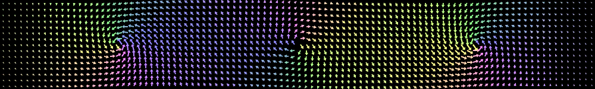
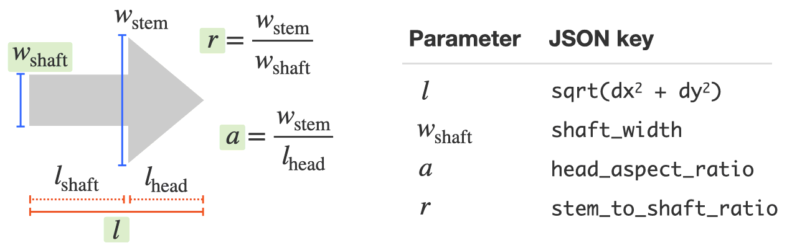

# Quiver plot tool

**quiver** is a small command-line tool to plot many arrows with varying
positions, lengths, widths and colors. The plot is specified by a JSON file
and saved to a PNG image.



- [Build](#build)
- [Usage](#usage)
- [Spec file](#spec-file)
- [License](#license)


## Build

Requires CMake and C++17 compiler.

```console
$ git clone https://github.com/snsinfu/quiver-plot.git
$ cd quiver-plot
$ mkdir _build
$ cd _build
$ cmake .. -DCMAKE_BUILD_TYPE=Release
$ make -j
$ ./quiver
```


## Usage

Pass quiver specification file as an argument to the command and you get a
PNG image.

```console
$ quiver spec.json
$ ls
spec.json  spec.png
```

The quiver specification is a JSON file. Below is a minimum example that
produces red, upward arrow and black, downward arrow. See [Spec file](#spec-file)
section below for full details.

```json
{
    "rendering": {
        "pixels_per_length": 100,
        "x_range": [-2, 2],
        "y_range": [-1.6, 1.6]
    },

    "style": {
        "background_color": [1, 1, 1],
        "arrow_color": [0, 0, 0],
        "shaft_width": 0.2
    },

    "arrows": [
        {"x": -1, "y": 0, "dx": 0, "dy":  1.5, "c": [1, 0, 0]},
        {"x":  1, "y": 0, "dx": 0, "dy": -1.5}
    ]
}
```


## Spec file

A spec file describes the style and data of arrows to plot in the JSON format.
The quiver program accepts the following keys:

```json
{
    "rendering": {
        "pixels_per_length": /* pixel density of the output image */,
        "x_range": /* range of x coordinate values */,
        "y_range": /* range of y coordinate values */,
        "output": /* output file name */
    },

    "style": {
        "background_color": /* color of background */,
        "arrow_color": /* default color of arrows */,
        "shaft_width": /* width of arrow */,
        "stem_to_shaft_ratio": /* relative width of arrowhead */,
        "head_aspect_ratio": /* aspect ratio of arrowhead */
    },

    "arrows": [
        {
            "x": /* x position */,
            "y": /* y position */,
            "dx": /* x component of vector */,
            "dy": /* y component of vector */,
            "w": /* width */,
            "a": /* aspect ratio */,
            "c": /* color */ 
        }
    ]
}
```

### Rendering options

All keys are optional.

| Key               | Example      | Description |
|-------------------|--------------|-------------|
| pixels_per_length | `100`        | Pixel density of the output image in the unit distance in the data coordinate. Higher value produces larger output image. |
| x_range           | `[-1, 1]`    | Range of x coordinate of the rendered region. |
| y_range           | `[-1, 1]`    | Range of y coordinate of the rendered region. |
| output            | `"plot.png"` | Output image filename. Must be PNG. Default is the same name of the spec file but with ".png" extension. |

### Styling options

All keys are optional.

| Key                 | Example       | Description |
|---------------------|---------------|-------------|
| background_color    | `[1, 1, 1]`   | RGB color of the background. Default is transparent. |
| arrow_color         | `[0, 0, 0.1]` | Default RGB color of arrows. |
| shaft_width         | `0.01`        | Default width of arrows. |
| stem_to_shaft_ratio | `3.5`         | Relative width of the arrowhead. |
| head_aspect_ratio   | `1.4`         | Aspect ratio of the arrowhead. |

See [Arrow shape](#arrow-shape) section below for detailed description of the
geometry of arrow.

### Arrow options

`x`, `y`, `dx` and `dy` are required. Other keys are optional.

| Key | Example       | Description |
|-----|---------------|-------------|
| x   | `0.1`         | The x coordinate of the point which the arrow starts from. |
| y   | `2.3`         | The y coordinate of the point which the arrow starts from. |
| dx  | `0.4`         | The x component of the arrow vector. |
| dy  | `-0.5`        | The y component of the arrow vector. |
| w   | `0.05`        | `shaft_width` for the arrow. |
| a   | `1.9`         | `head_aspect_ratio` for the arrow. |
| c   | `[1, 0, 0]`   | `arrow_color` for the arrow. |


### Arrow shape



The shape of an arrow is controlled by four independent parameters: `length`,
`shaft_width`, `stem_to_shaft_ratio` and `head_aspect_ratio`.

- `length` is computed by `sqrt(dx*dx + dy*dy)` for each arrow. It is the
  distance from the end of the shaft to the pointy end of the arrowhead.
- `shaft_width` specifies how fat the arrow looks. The `w` key of each arrow
  overrides this parameter.
- `stem_to_shaft_ratio` specifies the relative width of the arrowhead. Must
  be 1 or larger. Arrows usually look good with this parameter being 3-5.
- Setting `head_aspect_ratio` to a small value makes the arrowhead pointy.
  The default value of 1.4 produces the right angle at the pointy end. The
  `a` key of each arrow overrides this parameter.

If you plot arrows with varying shaft widths, you may want to scale
`head_aspect_ratio` linearly or with the square root of `shaft_width`,
thus contracting the arrowhead as arrow thickens. These seem to produce
aesthetically better-looking results than that without scaling.


## License

MIT License
